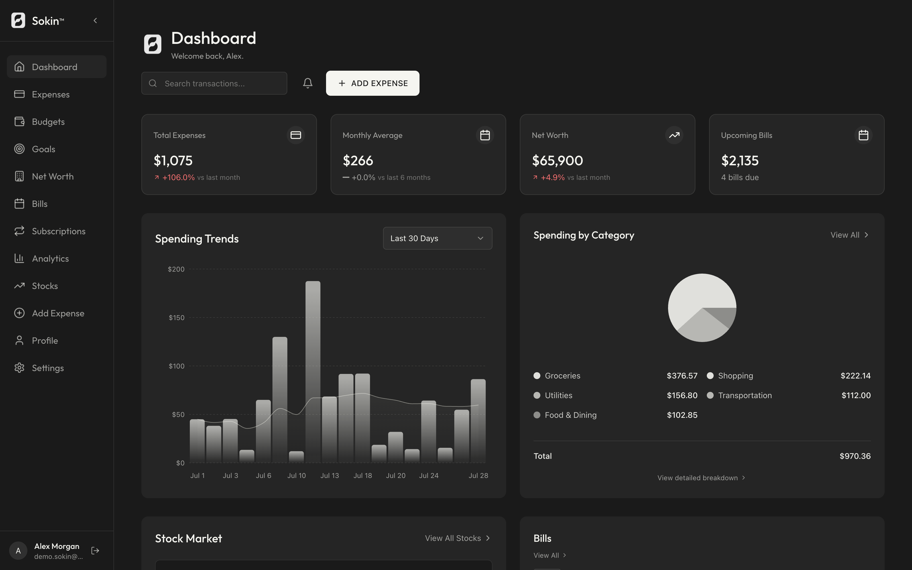
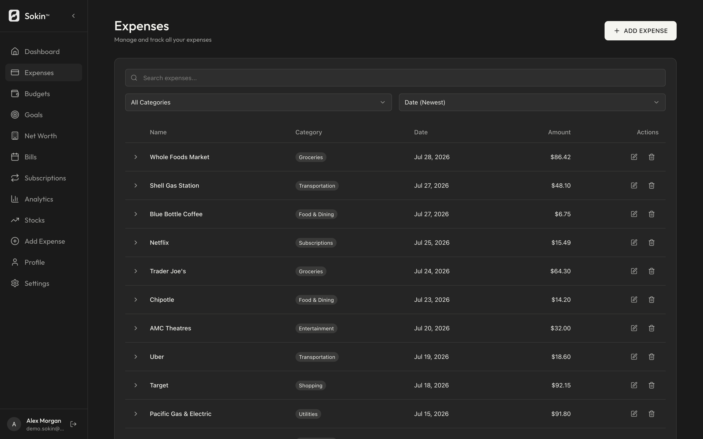
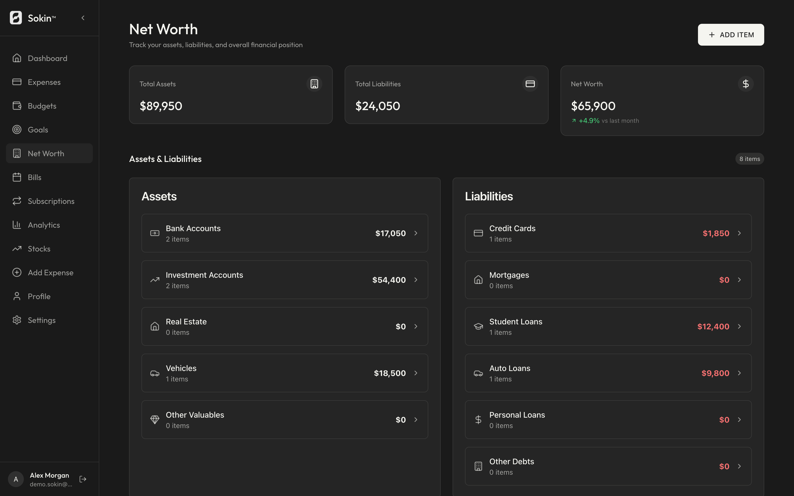

# Sokin

Personal finance app: expenses, budgets, savings goals, net worth, bill
reminders, subscriptions, receipt scanning, stock tracking, and AI-assisted
categorization and insights.



## Stack

| Layer | Choice |
|---|---|
| Frontend | Next.js 16 (App Router), React 19, TypeScript, Tailwind, Radix, Recharts |
| Backend | Express + TypeScript on Vercel serverless |
| Data | Firestore (29 composite indexes), Firebase Auth, Firebase Storage |
| Cache | Upstash Redis (REST) with an in-process tier |
| Market data | Finnhub |
| OCR | Google Cloud Vision |
| AI | Claude Opus 5 via `@anthropic-ai/sdk` — optional, see below |
| Tests | Jest (backend), Vitest + React Testing Library (frontend) |

73 API endpoints across 12 routers.

## Quick start

```bash
npm install
npm run dev            # frontend on :3000, API on :5001
```

Environment:

- `frontend/.env.local` — Firebase web config plus `NEXT_PUBLIC_API_URL`
- `backend/.env` — Firebase Admin credentials, `FINNHUB_API_KEY`,
  `UPSTASH_REDIS_REST_URL`, `UPSTASH_REDIS_REST_TOKEN`, `CORS_ORIGIN`,
  `CRON_SECRET`, and optionally `ANTHROPIC_API_KEY`

Full backend setup lives in [`backend/SETUP.md`](backend/SETUP.md); the route
list is in [`backend/API.md`](backend/API.md).

## Features

### Expenses

Add expenses manually or by scanning a receipt. Receipts upload to Firebase
Storage, are read by Cloud Vision, and are parsed into a categorized expense the
user confirms before it is saved — OCR proposes, it never writes on its own.
Expenses support search, category and date filtering, sorting, and editing.

### Budgets

Per-category limits over daily, weekly, monthly, yearly or custom periods,
tracked against real spending. A daily cron checks thresholds and raises
notifications while there is still time to act on them.

### Savings goals

Named targets with a running balance. Contributions go through a transactional
endpoint that increments the balance and appends to a contribution history, so
two concurrent contributions cannot lose one another. Milestone and completion
notices are driven by the balance the server stored, not by client arithmetic.

### Net worth

Assets and liabilities by category, with a monthly snapshot written on every
change. The trend chart plots **only snapshots that exist** — months without one
are absent rather than interpolated, and the summary stats show "—" rather than
inventing a percentage when there is no baseline to compare against.

### Bills and subscriptions

Recurring bill reminders with due-date tracking and an upcoming view, plus
subscription tracking with projected payment schedules and monthly/annual cost
totals.

### Stocks

Live quotes, company profiles and 52-week metrics from Finnhub, a watchlist, and
a transactional buy/sell portfolio with cost-basis and gain/loss tracking. Quotes
are cached 30s and profiles an hour, with batched requests so a portfolio refresh
stays inside the free tier.

### Analytics

Spending by category, monthly trends, budget progress, and a spending heatmap.
Dashboard money figures are aggregated server-side with Firestore `sum()` and
`count()` over the full expense history — not derived from the capped
recent-activity feed, which would silently undercount anyone with more than 50
transactions in the window.

### AI (optional)

Two Claude-backed features, both inactive unless `ANTHROPIC_API_KEY` is set:

- **Category suggestions** on the add-expense form. The model chooses from the
  app's own category vocabulary rather than free text, so a suggestion always
  lands in a bucket the charts and filters already group by. It is a suggestion
  the user applies — with confidence and one line of reasoning — never an
  automatic write.
- **Spending insights** on the dashboard: a short written summary of the month.
  The model is given pre-computed aggregates, never raw transactions, so it
  summarizes figures rather than doing arithmetic. The figures it was given are
  rendered beneath the prose so a reader can check the sentence against them.

Both use structured outputs, so responses are schema-valid rather than parsed out
of prose, and both opt into server-side fallbacks. Without a key,
`GET /api/ai/status` reports `available: false`, the feature routes answer 503
with a machine-readable reason, and the client hides the affordances entirely
rather than showing buttons that can only fail.

## Scripts

| Command | Purpose |
|---|---|
| `npm run dev` | Frontend + API together |
| `npm run dev:frontend` / `npm run dev:backend` | One side only |
| `npm run build` | Build both workspaces |
| `npm run lint` | ESLint across workspaces |
| `npm test --workspace=backend` | Jest suite (312 tests, 16 suites) |
| `npm test --workspace=frontend` | Vitest suite (165 tests, 12 files) |
| `npm run test:ci --workspace=backend` | Jest with coverage thresholds |

## How it works

The Next.js client authenticates with Firebase Auth and sends the resulting ID
token on every API call. Express verifies it with the Admin SDK and scopes each
query to that user; **nothing reads Firestore directly from the browser** — the
client Firebase SDK is initialized for auth only. Reads go through a two-tier
cache (in-process, then Upstash) with per-resource TTLs, and writes invalidate
the affected key patterns.

Rate limiting uses an atomic Redis counter so every serverless instance shares
one window, and falls back to per-instance metering rather than opening up if
Redis is unreachable. AI routes sit on a tighter budget than any other read path,
because each call costs money upstream.

The API client only retries requests that are safe to repeat. GET, HEAD, PUT and
DELETE are replayed on a 5xx or a dropped connection; POST and PATCH are not,
because a dropped connection means the response never arrived — not that the
request never landed, and replaying it would duplicate the write. 4xx is never
retried, since the same request is rejected identically every time.

## Known limitations

Documented rather than hidden. These are real and unfixed:

- **`usePortfolioState` duplicates a fetch.** It calls the portfolio endpoint
  independently of `StockMarket`, which already has that data, purely to pick a
  CSS class. Costs one redundant request per dashboard load.
- **Retry controls give no in-flight feedback.** After clicking "Try again" on a
  failed chart or metric card, React Query holds the error state while it
  refetches, so the control looks inert on a slow retry.
- **The date-normalization migration is not re-runnable.** The script in
  `scripts/migrations/` hardcodes absolute paths, and its rollback record was
  written to a session-scoped temp directory that no longer exists. It has
  already been applied; treat it as a record, not a tool.
- **`advanced-analytics` reserves the wrong height on failure.** Its error state
  is 240px while the section it replaces is roughly twice that, so the layout
  shifts when that specific panel fails.
- **AI prompts are untuned.** Both features are implemented and their failure
  paths verified, but they have not been exercised against a live API key, so the
  prompts have not been calibrated against real output.
- **45 `react-hooks/set-state-in-effect` warnings.** Demoted to warnings rather
  than fixed; each is a derive-instead-of-sync refactor.
- **Backend branch coverage is 34%.** The CI threshold sits just under that so a
  regression fails the build, but it is low.

## Screenshots

| | |
|---|---|
|  |  |

## License

MIT — see [LICENSE](LICENSE).
